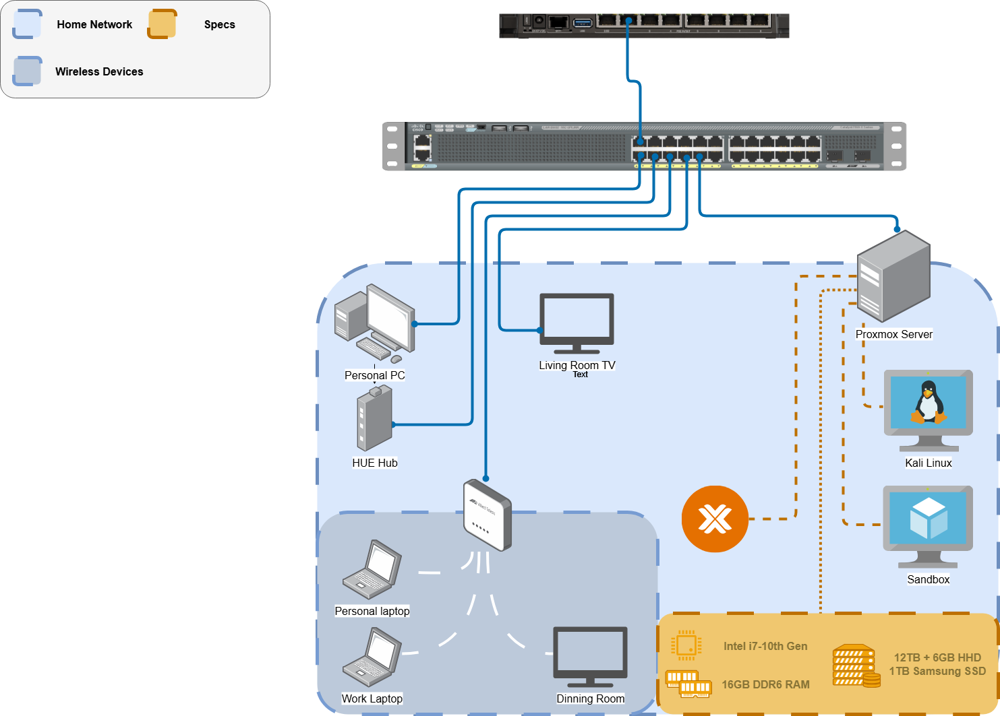

# 🏠 HomeLab: Personal Network & Self-Hosting Infrastructure

Welcome to my **HomeLab documentation** — a living project that details how I designed, built, and continue to evolve my personal home server and network infrastructure. This lab serves as a playground for learning enterprise technologies, experimenting with self-hosted services, and mastering modern IT practices through real hands-on implementation.

---

## 🧱 Purpose

This HomeLab exists to:

- Build practical experience in **virtualization, networking, and containerization**
- Host my own cloud services (e.g. file sync, DNS, dashboards)
- Explore **Proxmox, Nextcloud, Docker**, and **Linux networking**
- Simulate enterprise environments for red and blue team development
- Document every step as part of my learning and cybersecurity journey

---

## 🛠️ Hardware

| Component | Specs                |
|----------|----------------------|
| CPU      | Intel Core i7        |
| GPU      | NVIDIA GTX 1070      |
| RAM      | 16GB DDR4            |
| Storage  | 1TB SSD (OS/VMs)     |
| Storage  | 12TB + 6TB HDD (Bulk) |

> Hypervisor: **Proxmox VE**  
> Containers: **Docker & Portainer**  
> Network Control: VLANs, static routes, and future MikroTik ACLs  

---
## Current Network Topology:

## 🌐 Future Network Topology:

> 📌 *Note: This is a living diagram and will evolve as I progress through CCNA and CCNP certifications.*

---

## 🔧 Current Services Running

| Service      | Platform   | Purpose                                 |
|--------------|------------|-----------------------------------------|
| Proxmox VE   | Bare Metal | Hypervisor & VM Management              |
| Nextcloud    | Docker     | Private Cloud, File Sync & Share        |
| Nginx Proxy  | Docker     | Reverse Proxy for self-hosted services  |
| Pi-hole      | Docker     | Network-wide DNS-level Ad Blocker       |
| Portainer    | Docker     | Container Management UI                 |
| Uptime Kuma  | Docker     | Uptime Monitoring for Hosted Services   |

---

## 🚀 Future Plans & Vision

This lab is just the beginning. Here's what I plan to implement and experiment with in the near future:

- 🌩️ **Full CI/CD Pipeline**
  - Jenkins, GitHub Actions, or Drone CI for automation
- 🔐 **Active Directory or FreeIPA**
  - Identity management and user/group access simulation
- 🛡️ **Security Monitoring**
  - ELK Stack or Wazuh for log aggregation, detection, and alerting
- 📊 **Self-Hosted Dashboards**
  - Grafana + Prometheus for visualizing resource usage and uptime
- 🛰️ **DMZ & VLAN Segmentation**
  - To simulate real-world segmented network environments
- ☁️ **Hybrid Cloud Integration**
  - AWS/GCP lab hybrid for real-world red/blue team testing
- 🧪 **Offensive Lab Range**
  - Isolated network for exploit testing, malware analysis, and pentest tooling

---

## 🧠 Why It Matters

This HomeLab is more than a hobby — it’s a **real-world simulation environment**. It trains me in:

- 🖧 Advanced Networking & Routing
- 📦 Docker & Infrastructure as Code
- ☁️ Cloud-Edge Hybrid Deployments
- 🔐 Blue & Red Team Experimentation
- 📚 End-to-end Documentation Discipline

---
